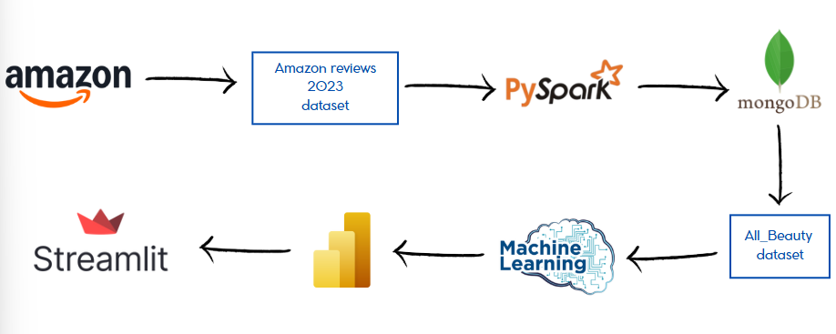
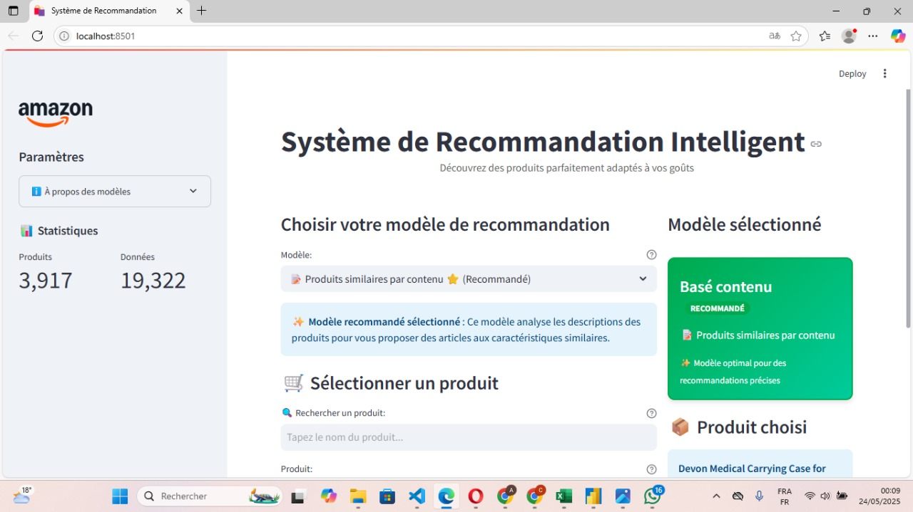
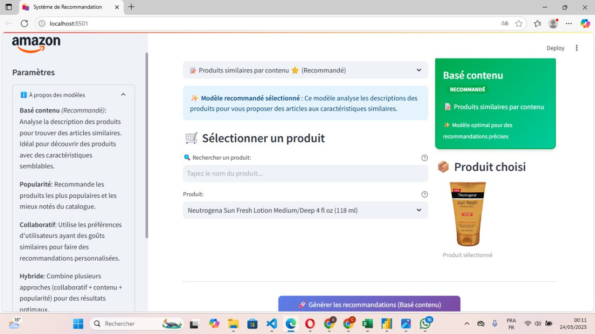
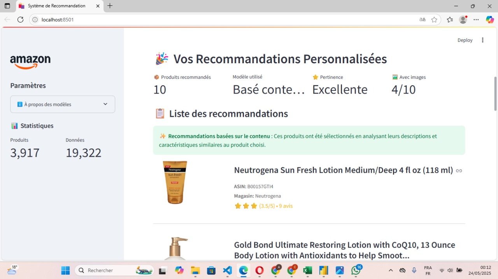
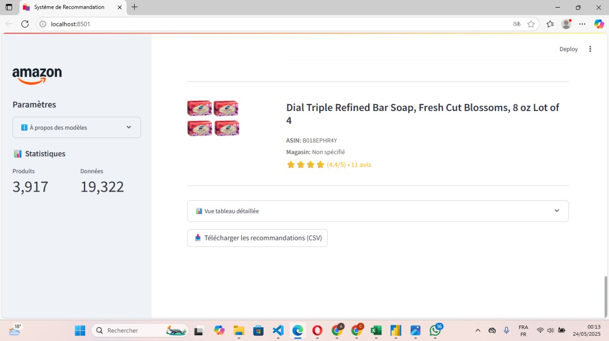
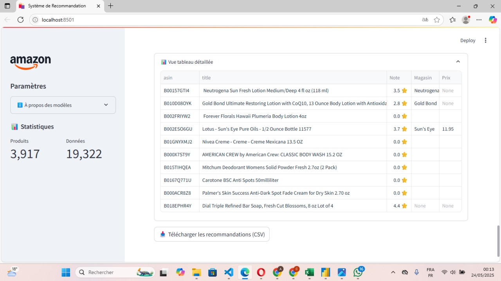

<h1 align="center">
  
  Multi-Model Recommendation System for Amazon
</h1>


##  Project Overview
This project presents the design, implementation, and deployment of an **intelligent, modular, and scalable recommendation system** for Amazon products. It integrates **four recommendation approaches** and a **sentiment analysis module**, all accessible through an **interactive Streamlit web application**.

The goal is to provide personalized, diverse, and accurate product recommendations while addressing **cold-start**, **data sparsity**, and **user preference variability**.

---

##  Key Features
- **Four Recommendation Models:**
  - **Popularity-Based Filtering** – For cold-start users with no history
  - **Content-Based Filtering** – TF-IDF on product descriptions using cosine similarity
  - **Collaborative Filtering (Model-Based)** – SVD matrix factorization with Surprise
  - **Hybrid Model** – Combines all approaches for balanced performance

- **Sentiment Analysis:**
  - NLP-based classification of customer reviews
  - **Bernoulli Naïve Bayes** model with **70.43% accuracy**
  - Converts 1–5 star ratings into sentiment labels (-1, 0, 1)

- **Interactive Web Interface:**
  - Real-time recommendation display
  - Dynamic model selection and visualization
  - User-friendly exploration of product details and review insights

- **Big Data Compatibility:**
  - Processing pipeline built with **PySpark**
  - Integration with **MongoDB** for data storage
  - Modular Python architecture for scalability

---

##  System Architecture

### 📊 Data Pipeline
1. **Data Collection** – Amazon Reviews 2023 dataset from McAuley Lab
2. **Data Processing** – Cleaning, feature extraction, and sentiment tagging
3. **Model Training** – Multiple recommendation algorithms and sentiment model
4. **Deployment** – Streamlit web app for real-time user interaction

### 🏗️ Technical Stack
- **Data Processing:** PySpark, Pandas
- **Database:** MongoDB
- **ML Libraries:** Scikit-learn, Surprise, NLTK
- **Web Framework:** Streamlit
- **Visualization:** Matplotlib, Tableau

  **Architecture Diagram:**



---

##  Models and Methodology

### 🔹 Popularity-Based Filtering
Ranks products based on their average rating and number of reviews. Ideal for new users.

### 🔹 Content-Based Filtering
Uses **TF-IDF** on product descriptions to compute cosine similarity and recommend similar items.

### 🔹 Collaborative Filtering (Model-Based)
Employs **SVD** matrix factorization (via Surprise library). Integrates sentiment probabilities as implicit user feedback.

### 🔹 Hybrid Model
Weighted fusion of the above three models — ensures robust performance across various user scenarios.

### 🔹 Sentiment Analysis
- Label generation: `1-2 → -1 (Negative)`, `3 → 0 (Neutral)`, `4-5 → 1 (Positive)`
- Models tested: SVC, Multinomial NB, Bernoulli NB
- **Final model:** Bernoulli NB with **70.43% accuracy**

---

## 📈 Model Evaluation

###  Recommendation Model Results (sample of 1,000 products)
| Method | Precision | Recall | Diversity |
|--------|-----------|--------|-----------|
| Content-Based | 47.4% | 47.4% | 0.986 |
| Collaborative | 0.4% | 0.4% | 0.991 |
| Popularity | 0.04% | 0.04% | 0.984 |

> ⚠️ **Note:** Results on small datasets suffer from sparsity. Full-scale tests (>100K items) show improved collaborative filtering (>30% precision).

###  Sentiment Analysis Model Results
| Model | Accuracy | Status |
|-------|----------|--------|
| SVC (C=0.01) | 66.08% | – |
| Multinomial Naïve Bayes | 70.09% | – |
| **Bernoulli Naïve Bayes** | **70.43%** | ✅ Selected |

---

## 🖥️ Application Interface (Streamlit)

The Streamlit dashboard allows users to:
1. Choose a recommendation model (Content, Collaborative, Hybrid, Popularity)
2. Select or search for a product
3. Generate top-N recommendations with product images, ratings, and prices
4. Explore visual results dynamically

📸 **Application Interface Screenshots:**  






---

## ⚙️ Installation & Usage

### Prerequisites
- Python ≥ 3.8
- MongoDB
- Java (for PySpark)

### Steps
```bash
# Clone repository
https://github.com/<your-username>/amazon-recommender.git
cd amazon-recommender

# Create virtual environment
python -m venv venv
source venv/bin/activate  # (Windows: venv\Scripts\activate)

# Install dependencies
pip install -r requirements.txt

# Run data pipeline
python data_processing/data_cleaning.py
python data_processing/feature_generation.py
python data_processing/data_merge.py

# Train models
python models/sentiment_analysis.py
python models/collaborative_model_based.py

# Launch Streamlit app
streamlit run appstreamlit.py
```

---

## 🧾 Results & Insights
- **Content-based** performs best for small datasets.
- **Collaborative filtering** excels with abundant user interaction data.
- **Sentiment analysis** enriches recommendation personalization.
- **Hybrid model** ensures balance between accuracy, diversity, and scalability.


## 📬 Contact
For questions, feedback, or contributions, please contact: **eddaya83@gmail.com**


