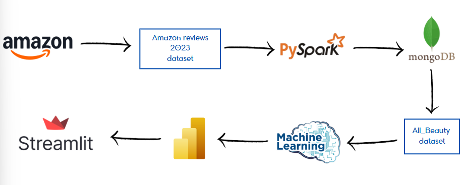
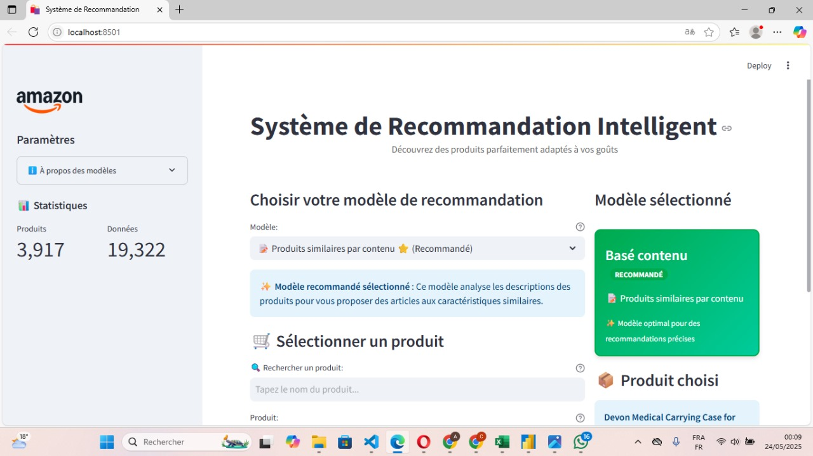
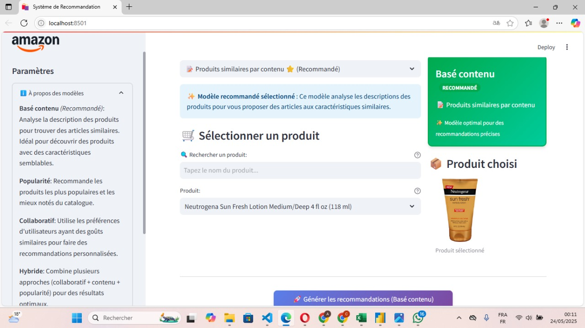
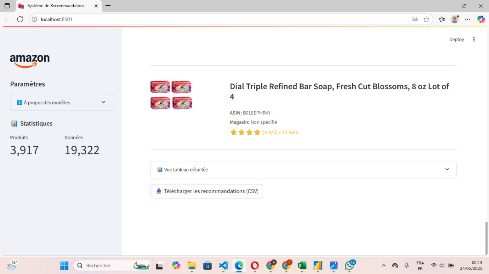
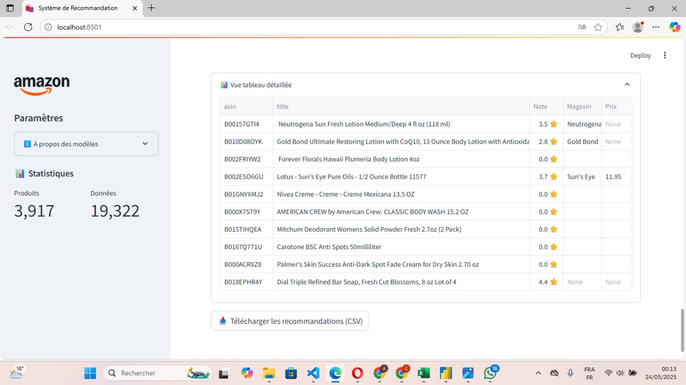

<h1>
  
  &nbsp;Multi-Model Recommendation System for Amazon
</h1>


##  Project Overview
This project presents the design, implementation, and deployment of an **intelligent, modular, and scalable recommendation system** for Amazon products. It integrates **four recommendation approaches** and a **sentiment analysis module**, all accessible through an **interactive Streamlit web application**.

The goal is to provide personalized, diverse, and accurate product recommendations while addressing **cold-start**, **data sparsity**, and **user preference variability**.

---

##  Key Features
- **Four Recommendation Models:**
  - **Popularity-Based Filtering** – For cold-start users with no history
  - **Content-Based Filtering** – TF-IDF on product descriptions using cosine similarity
  - **Collaborative Filtering (Model-Based)** – SVD matrix factorization with Surprise
  - **Hybrid Model** – Combines all approaches for balanced performance

- **Sentiment Analysis:**
  - NLP-based classification of customer reviews
  - **Bernoulli Naïve Bayes** model with **70.43% accuracy**
  - Converts 1–5 star ratings into sentiment labels (-1, 0, 1)

- **Interactive Web Interface:**
  - Real-time recommendation display
  - Dynamic model selection and visualization
  - User-friendly exploration of product details and review insights

- **Big Data Compatibility:**
  - Processing pipeline built with **PySpark**
  - Integration with **MongoDB** for data storage
  - Modular Python architecture for scalability

---

##  System Architecture

### 📊 Data Pipeline
1. **Data Collection** – Amazon Reviews 2023 dataset from McAuley Lab
2. **Data Processing** – Cleaning, feature extraction, and sentiment tagging
3. **Model Training** – Multiple recommendation algorithms and sentiment model
4. **Deployment** – Streamlit web app for real-time user interaction

### 🏗️ Technical Stack
- **Data Processing:** PySpark, Pandas
- **Database:** MongoDB
- **ML Libraries:** Scikit-learn, Surprise, NLTK
- **Web Framework:** Streamlit
- **Visualization:** Matplotlib, Tableau

  **Architecture Diagram:**



---

##  Models and Methodology

### 🔹 Popularity-Based Filtering
Ranks products based on their average rating and number of reviews. Ideal for new users.

### 🔹 Content-Based Filtering
Uses **TF-IDF** on product descriptions to compute cosine similarity and recommend similar items.

### 🔹 Collaborative Filtering (Model-Based)
Employs **SVD** matrix factorization (via Surprise library). Integrates sentiment probabilities as implicit user feedback.

### 🔹 Hybrid Model
Weighted fusion of the above three models — ensures robust performance across various user scenarios.

### 🔹 Sentiment Analysis
- Label generation: `1-2 → -1 (Negative)`, `3 → 0 (Neutral)`, `4-5 → 1 (Positive)`
- Models tested: SVC, Multinomial NB, Bernoulli NB
- **Final model:** Bernoulli NB with **70.43% accuracy**

---

## 📈 Model Evaluation

###  Recommendation Model Results (sample of 1,000 products)
| Method | Precision | Recall | Diversity |
|--------|-----------|--------|-----------|
| Content-Based | 47.4% | 47.4% | 0.986 |
| Collaborative | 0.4% | 0.4% | 0.991 |
| Popularity | 0.04% | 0.04% | 0.984 |

> ⚠️ **Note:** Results on small datasets suffer from sparsity. Full-scale tests (>100K items) show improved collaborative filtering (>30% precision).

###  Sentiment Analysis Model Results
| Model | Accuracy | Status |
|-------|----------|--------|
| SVC (C=0.01) | 66.08% | – |
| Multinomial Naïve Bayes | 70.09% | – |
| **Bernoulli Naïve Bayes** | **70.43%** | ✅ Selected |

---

## 🖥️ Application Interface (Streamlit)

The Streamlit dashboard allows users to:
1. Choose a recommendation model (Content, Collaborative, Hybrid, Popularity)
2. Select or search for a product
3. Generate top-N recommendations with product images, ratings, and prices
4. Explore visual results dynamically

📸 **Application Interface Screenshots:**  






---

## ⚙️ Installation & Usage

### Prerequisites
- Python ≥ 3.8
- MongoDB
- Java (for PySpark)

### Steps
```bash
# Clone repository
https://github.com/<your-username>/amazon-recommender.git
cd amazon-recommender

# Create virtual environment
python -m venv venv
source venv/bin/activate  # (Windows: venv\Scripts\activate)

# Install dependencies
pip install -r requirements.txt

# Run data pipeline
python data_processing/data_cleaning.py
python data_processing/feature_generation.py
python data_processing/data_merge.py

# Train models
python models/sentiment_analysis.py
python models/collaborative_model_based.py

# Launch Streamlit app
streamlit run appstreamlit.py
```

---

## 🧾 Results & Insights
- **Content-based** performs best for small datasets.
- **Collaborative filtering** excels with abundant user interaction data.
- **Sentiment analysis** enriches recommendation personalization.
- **Hybrid model** ensures balance between accuracy, diversity, and scalability.


## OAR Data Pipeline – End-to-End Mini Traceability Project
 # Project Overview

This project implements an end-to-end data pipeline based on the Open Apparel Registry (OAR) / Open Supply Hub public data.
The objective is to demonstrate the ability to work with real-world supply chain data by building a fully automated pipeline covering:

1.Data ingestion and consolidation

2.Data cleaning and normalization

3.Facility and company processing

4.Relational structuring

5.Basic analytics

6.A lightweight AI component

All steps are implemented in Python, follow a modular design, and are orchestrated through a single entry point (main.py).

# Project Structure
OAR_DATA_PIPELINE/
│
├── data/
│   ├── raw/                  # Original raw CSV exports (no manual edits)
│   ├── intermediate/          # Pipeline intermediate outputs
│   │   ├── analytics/         # Charts generated during analytics phase
│   │   └── relational/        # Normalized relational tables
│   └── final/                 # Final exported datasets and reports
│
├── scrape_oar.py              # Phase 1 – Raw data merge & ingestion
├── clean_companies.py         # Phase 2 – Company cleaning & ID generation
├── clean_facilities.py        # Phase 3 – Facility processing & linking
├── relational_builder.py      # Phase 4 – Relational consistency checks
├── analytics_dashboards.py    # Phase 5 – Analytics & visualizations
├── ai_module.py               # Phase 6 – AI module (keyword-based detection)
├── export_final.py            # Phase 7 – Final export & summary stats
├── main.py                    # Phase 8 – Pipeline orchestration
│
├── requirements.txt
├── README.md
└── .gitignore

# How to Run the Pipeline
1️.Install dependencies
pip install -r requirements.txt

2️. Run the full pipeline
python main.py


The pipeline runs end-to-end without manual intervention and logs each phase.

## Pipeline Phases
# Phase 1 – Data Extraction & Consolidation

-Merges multiple public OAR CSV exports

-Filters by the required countries:"France, Italy, Spain, Portugal, Morocco, Greece, Malta"

-Preserves data traceability using source file metadata

# Phase 2 – Company Cleaning

-Normalizes company names (punctuation, casing, legal suffixes)

-Standardizes country information

-Generates a deterministic company_id using hashing

# Phase 3 – Facility Processing

-Cleans and normalizes facility names

-Generates unique facility_id

-Links facilities to companies

Outputs:

facilities_clean.csv

company_facilities.csv

# Phase 4 – Relational Structuring

-Builds consistent relational tables:companies,facilities,company_facilities.

-Ensures no orphan records

# Phase 5 – Analytics & Dashboards

-Companies by country (bar chart)

-Facilities per company (distribution)

Outputs saved as PNG files

# Phase 6 – AI Module

-Simple keyword-based sustainability signal detection

-Flags companies mentioning sustainability-related terms

Outputs structured CSV results

# Phase 7 – Final Export

-Exports final datasets

-Generates summary statistics:Total companies,Total facilities,Average facilities per company,Maximum facilities per company

# Phase 8 – Orchestration

-main.py runs all phases in order

-Handles errors and logs execution progress

## Dataset Summary (Current Run)
Metric	Value
Total companies	837
Total facilities	852
Avg facilities per company	~1.02
Max facilities per company	3
## Data Access Limitation (Important Note)

Full Open Supply Hub API access and large bulk exports are paid.
Therefore, this pipeline was validated on a public subset of data (852 facilities).

The pipeline is fully scalable: adding more raw CSV exports automatically increases data volume without any code changes.

This reflects real-world constraints and demonstrates robust, production-ready design.


## Conclusion

This project delivers a complete, automated, and scalable data pipeline for supply chain traceability analysis using OAR data.
It demonstrates strong data engineering fundamentals, clean architecture, and practical handling of real-world data constraints.


## 📬 Contact
For questions, feedback, or contributions, please contact: **eddaya83@gmail.com**


